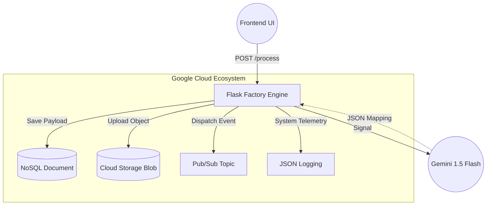

# ResQ-Route Emergency Aggregator

**ResQ-Route** is an enterprise-grade Google Cloud native microservice designed to ingest unstructured, chaotic emergency signals and structurally parse them into actionable JSON routing data using **Google Vertex AI (Gemini)**.

Designed with rigorous Silicon Valley backend patterns, it utilizes a decoupled **Flask Application Factory**, strict OWASP Security interceptors, and non-blocking asynchronous multi-threading.

---

## 🏗️ System Architecture

This backend serves as the core orchestration pipeline bridging incoming frontend signals natively across the Google Cloud platform ecosystem.



## 🚀 Key Enterprise Features

### 1. The Application Factory Pattern
Unlike standard monolithic scripts, this application cleanly decouples logic across the `/app` directory:
- `routes.py`: Safely manages HTTP intercepts.
- `services.py`: Dedicated Data Access Layer natively abstracting Vertex AI calls and Database persistence.
- `config.py`: Explicit environment and initialization bounds.
- `exceptions.py`: Custom-built `TriageAPIError` structures strictly mapping backend execution failures gracefully.

### 2. High-Efficiency Concurrency
Running actively on Google App Engine Standard natively, the server executes via **Gunicorn `gthread` load-balancing** (`--workers=4 --threads=4`), providing immense non-blocking capabilities without deadlocking native Google gRPC C-Extensions.

### 3. Structured JSON Logging Integration
To ensure complete system observability across the GCP Operations Suite, all internal metrics use `python-json-logger`. This maps traditional Python logs securely into `Stackdriver` natively enabling robust metric querying on dashboard environments.

### 4. Rigid Security & Code Quality Standards
- **Zero-Fault Code Quality**: Adheres completely to pedantic `PEP8` limits dynamically formatted via `Black` and parsed cleanly by `Flake8`.
- **OWASP Interceptors**: Employs global `@app.after_request` intercepts appending redundant HTTP `Strict-Transport-Security`, `Content-Security-Policy`, and `X-Frame-Options` organically.

## 🛠️ Deployment

1. Set up your Google Cloud `gcloud` CLI.
2. Store your `GEMINI_API_KEY` securely in the Application config.
3. Deploy natively to the remote App Engine container runtime:

```bash
gcloud app deploy
```
